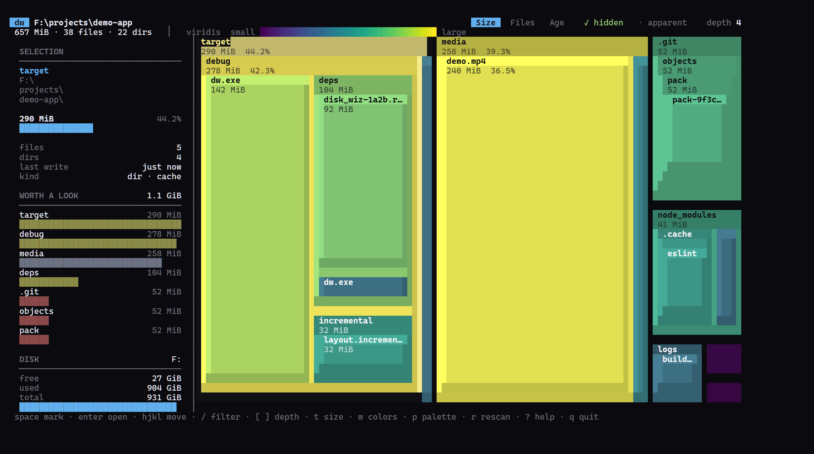

# disk-wiz

[](https://github.com/mozayed007/disk-wiz/actions/workflows/ci.yml)
[](#license)
[](#install)

A disk usage tool with two personalities in one binary:

- **Interactive TUI** (default on a terminal): a squarified treemap with live
  scan progress, keyboard-first navigation, zoom, depth control, filtering, a
  details sidebar, and "worth a look" heuristics.
- **Pipe-friendly CLI** (default when piped): `flat` (du-like), `tree`, `json`,
  and `ansi` treemap output, with ls-like flags for sorting, filtering, depth,
  and limits.



## Why

- **One binary, both modes.** `dw` gives you the treemap in a terminal and
  du-like output in scripts: `-p` forces text, `--format json` hands the tree
  to `jq`.
- **`du`-faithful sizes.** Allocated blocks on Unix, logical bytes on Windows,
  hardlink dedupe and cycle-safe symlink handling included.
- **A TUI that keeps you oriented.** Zoom, depth, name filters, size/age/
  category coloring, and a sidebar that answers how big the selection is, how
  much of the view it takes, when it last changed, and what kind of thing it
  is.
- **"Worth a look".** Large or stale build output, caches, `node_modules`, and
  fat logs are surfaced instead of making you hunt for them.
- **Cross-platform and tested.** CI on Windows, Linux, and macOS; treemap
  invariants are property-tested.

## Install

```sh
cargo install --path .                                      # from a clone
cargo install --git https://github.com/mozayed007/disk-wiz  # from GitHub
```

This builds the `dw` binary.

## Quick start

```sh
dw                             # treemap TUI for the current directory
dw -p --format flat --depth 1  # one row per top-level entry (du-like)
dw -p --format tree --depth 2  # indented tree
dw --json | jq '.children'     # machine-readable
dw --threshold 50G /           # exit code 4 over budget (CI-friendly)
```

`dw -p --format flat --depth 1 --top 10` on a sample project:

```text
657 MiB	demo-app
290 MiB	demo-app\target
258 MiB	demo-app\media
52 MiB	demo-app\.git
41 MiB	demo-app\node_modules
12 MiB	demo-app\logs
1.8 MiB	demo-app\package-lock.json
1.7 MiB	demo-app\src
112 KiB	demo-app\Cargo.lock
64 KiB	demo-app\docs
```

`dw --format tree --depth 1`:

```text
657 MiB  demo-app
├──    290 MiB  target
├──    258 MiB  media
├──     52 MiB  .git
├──     41 MiB  node_modules
├──     12 MiB  logs
├──    1.8 MiB  package-lock.json
├──    1.7 MiB  src
├──    112 KiB  Cargo.lock
├──     64 KiB  docs
├──     64 KiB  tests
├──     20 KiB  README.md
├──    8.0 KiB  benches
├──    2.0 KiB  Cargo.toml
└──      512 B  .env
```

## TUI

```sh
dw                    # scan the current directory
dw ~/src --depth 3    # start at depth 3
dw --palette magma --color-mode size
```

Keys (all rebindable, see Configuration):

| Key | Action |
|---|---|
| `h j k l` / arrows | move the selection |
| `enter` / `o` | open (zoom into the selected directory) |
| `backspace` / `u` | up one level |
| `[` `]` | decrease / increase depth |
| `t` | cycle size / files / age |
| `m` | cycle colors: category / size / age / depth |
| `H` | toggle hidden entries (rescans) |
| `a` | toggle apparent size (rescans) |
| `/` | filter by name (esc clears) |
| `space` | mark / unmark the selection |
| `d` | move marked entries to the trash (with confirmation) |
| `c` | clear marks |
| `r` | rescan |
| `0` | reset the view |
| `?` | help |
| `q` / `ctrl-c` | quit |

Mouse: click selects, double click opens, right click goes up, the wheel moves
the selection.

The sidebar shows the selection (size, share of the view, files, dirs, last
write, kind, category), the "worth a look" list (large or stale build output,
caches, `node_modules`, ...), and free/used/total disk space.

## CLI

```sh
dw -p --format flat -n 20      # top 20 entries by size
dw --format tree -d 2          # indented tree
dw --json | jq '.children'     # machine-readable
dw --format ansi --width 120   # treemap rendered to stdout
dw --min-size 1G --type cache  # big cache entries
dw --exclude '**/node_modules/**'
dw --threshold 50G /var        # exit code 4 when over budget (CI-friendly)
```

| Flag | Meaning |
|---|---|
| `-p, --print` | force non-interactive output |
| `-f, --format <auto\|tui\|flat\|tree\|json\|ansi>` | output format |
| `-d, --depth <N>` | maximum depth (tree defaults to 2) |
| `-n, --top <N>` | row limit (flat) or per-directory limit (tree) |
| `--sort <size\|files\|mtime\|name>`, `--reverse` | ordering |
| `--min-size`, `--max-size <SIZE>` | size filters (`10M`, `1.5GiB`) |
| `--type <CAT,...>` | category filter (`--list-categories`) |
| `--exclude <GLOB>` (repeatable), `--exclude-file <PATH>` | skip entries |
| `--hidden` / `--no-hidden` | hidden entries (default: included) |
| `--apparent-size` | logical bytes instead of allocated blocks |
| `--follow`, `--one-file-system`, `--count-links` | scan behavior |
| `--threads <N>` | scanner threads |
| `--color <auto\|always\|never>` | color output (`NO_COLOR` honored) |
| `--palette <NAME>`, `--color-mode <category\|size\|age\|depth>` | colors |
| `--width`, `--height` | ansi output size |
| `--json`, `--bytes`, `--quiet`, `--verbose` | output details |
| `--strict`, `--threshold <SIZE>` | exit codes 3 and 4 |
| `--list-palettes`, `--list-categories` | introspection |
| `--completions <SHELL>` | shell completions |

Exit codes: `0` ok, `1` error, `2` usage, `3` scan errors with `--strict`,
`4` total exceeded `--threshold`.

## Colors

- `size` (default): a sequential ramp over size with `scale = linear | log |
  rank` (log by default) and optional discrete `tiers`. Lightness varies with
  size, so hierarchy stays legible.
- `category`: file-type categories (code, media, documents, cache, git,
  toolchains, agent scratch, synced) with muted colors; nesting is carried by
  depth-based lightness steps.
- `age`: a ramp over the newest mtime in each subtree.
- `depth`: a categorical cycle by nesting depth.

Press `m` in the TUI to cycle color modes, or set `color.mode` in the config.

Palettes: `viridis` (default), `magma`, `inferno`, `plasma`, `cividis`,
`turbo`, `spectral`, plus categorical `okabe-ito`, `tableau10`, and `dim`.
Themes: `auto` (default, uses the terminal's own colors), `dark`, and `light`,
plus a `reverse` flag. The TUI shows a legend row: category swatches in
`category` mode, and a ramp preview in `size`/`age`/`depth` modes.

## Configuration

`~/.config/disk-wiz/config.toml` (Linux/macOS) or
`%APPDATA%\disk-wiz\config.toml` (Windows). Precedence: defaults < config file
< environment < CLI flags. See `docs/config.example.toml` for the full schema.

```toml
[scan]
hidden = true
exclude = ["**/.git/objects/**"]

[tui]
depth = 4
size_mode = "size"
sidebar = "auto"
sidebar_position = "left"
mouse = true

[color]
mode = "category"
palette = "viridis"
scale = "log"
theme = "dark"

[color.categories]
code = { color = "#4C8BF5", globs = ["*.rs", "*.py"] }

[worth_a_look]
max_items = 7
rules = [
  { name = "build output", glob = "**/{target,dist,build}", older_than = "7d" },
]

[keys]
quit = ["q", "C-c"]
zoom_in = ["enter", "o"]
```

## Semantics

- Sizes match `du` conventions: allocated blocks by default on Unix, logical
  bytes on Windows (which has no allocated-block API in `std::fs`).
- Directory metadata is included in totals, like `du`.
- Hardlinks are counted once on Unix (`--count-links` overrides); Windows
  hardlink dedupe is not implemented in v1.
- Symlinks are counted as entries, never followed unless `--follow` is given
  (cycle-safe).
- Junctions and reparse points are never followed.
- Permission errors are counted, sampled, and never abort a scan.

## Development

```sh
cargo test                 # unit + integration tests (TUI via TestBackend)
cargo clippy --all-targets # lint
cargo bench                # scanner and layout benchmarks
cargo test dump_frame -- --ignored --nocapture   # render the TUI to stdout
```

Layout invariants (tiling, disjointness, determinism) are property-tested;
scanner totals are cross-checked against fixture sizes; the CLI is tested
end-to-end with `assert_cmd`. Design notes and the v1 plan live in
`docs/PLAN.md`.

## License

Dual licensed under MIT or Apache-2.0, at your option.
