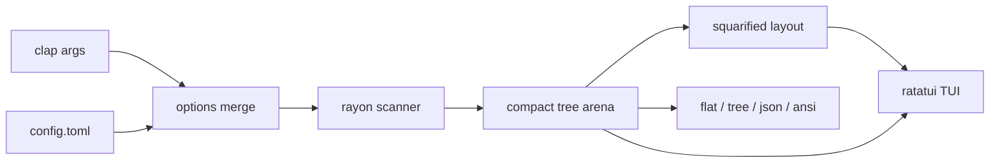

# disk-wiz (`dw`) - build plan

Status: implemented in v0.1. This document is kept as the design record; see
"Implementation notes" at the end for deviations.
Target: `F:\projects\Disk-wiz` (empty, greenfield). This document is intended to be
committed verbatim as `docs/PLAN.md` in the repo as part of M0.

## 1. Vision

A disk usage tool with two personalities in one binary:

- **Interactive TUI** (default on a TTY): disktree-style squarified treemap with
  live scan progress, keyboard-first navigation, zoom, depth control, filtering,
  details sidebar, and "worth a look" heuristics.
- **Non-interactive CLI** (default when piped, or via `--format`): pipe-friendly
  `flat` (du-like), `tree`, `json`, and `ansi` (treemap to stdout) output with
  ls-like flags for sorting, filtering, depth, and limits.

Priorities, in order: **correctness, configuration flexibility, usability, speed**.

## 2. Locked decisions

| Topic | Decision |
|---|---|
| Language | Rust, stable, edition 2024, 64-bit only |
| Platforms | Windows, Linux, macOS first-class; CI on all three from day one |
| Binary / crate | binary `dw`, crate `disk-wiz` |
| TUI stack | `ratatui` + `crossterm` |
| Scanner | recursive `rayon` traversal; `jwalk` as a benchmarked fallback behind the same trait |
| Config | TOML at platform config dir; layered defaults < file < env < CLI flags |
| File ops in v1 | mark + move to OS trash only, one confirmation; no permanent delete anywhere |
| License | dual MIT / Apache-2.0 |
| Scan semantics | allocated size default on Unix (`du`), logical size on Windows (documented), `--apparent-size` toggle |

## 3. Non-goals (v1)

- Permanent delete. Not shipped in any form in v1.
- Following symlinks by default (opt-in `--follow` with cycle detection).
- Archive inspection (zip/tar contents).
- Network filesystem special cases beyond `--one-file-system`.
- Scan diffing and image export (M7 optional).
- `.gitignore`-aware scanning (possible later `--gitignore` flag).

## 4. Architecture



Repo layout:

```
Cargo.toml
docs/PLAN.md
src/
  main.rs            entry, dispatch TUI vs CLI
  cli.rs             clap definitions, completions
  config/            schema, layering, keymap parsing
  scan/              parallel walker, progress, cancellation, errors
  tree/              arena storage, aggregation, sort, filter
  layout/            squarified treemap on an integer cell grid
  color/             palettes, categories, scaling, quantization
  ui/                app loop, event handling, theme
  ui/views/          treemap, header, sidebar, footer, help, filter, confirm
  output/            flat, tree, json, ansi renderers
  util/              size parsing/formatting, time, paths
tests/               CLI integration tests (assert_cmd) + fixtures
benches/             criterion: scan, aggregate, layout
```

### 4.1 Scanner

- `scan_dir(path, opts, ctx) -> DirNode`, recursion parallelized with `rayon::join`
  over subdirectories. Bounded by CPU count; `--threads` overrides.
- `ctx` carries: atomic counters (entries, bytes, dirs, errors), a cancellation
  flag checked in loops, and a throttled progress channel.
- `lstat` semantics: symlinks are entries, not traversals. Junctions and reparse
  points on Windows are never followed.
- Sizes: Unix allocated = `st_blocks * 512`, apparent = `st_size`; Windows
  logical = file size (documented deviation), apparent toggle affects nothing
  there until a compressed-size pass is added.
- Hardlinks: deduped by `(dev, ino)` on Unix by default, `--count-links` opts out.
  Windows dedupe via `(volume_serial, file_index)` is opt-in (expensive per file).
- `--one-file-system`: compare `st_dev` / volume serial against the root.
- Errors (permission denied, transient ENOENT) are counted and sampled, never
  abort the scan.
- Progress: atomics polled by the UI every ~100ms; CLI prints a progress line to
  stderr only when stderr is a TTY and `--quiet` is absent.

### 4.2 Tree storage

- Scan builds a boxed tree; on completion it is flattened into an arena in DFS
  order for cache-friendly reads.
- `Node`: name range into a byte arena, aggregate size, file count, dir count,
  max mtime (u32 epoch secs), kind, child range. Target <= 64 B/entry including
  name bytes for typical trees (4M entries < ~300 MB).
- Children sorted descending by the active size mode after aggregation; mode
  changes re-sort lazily per visible directory with a memo.
- Zoom state is a path of node indices; the breadcrumb renders from names.

### 4.3 Layout

- Squarified treemap computed on the character-cell grid: f64 algorithm, then
  integer rounding with a 1x1 minimum per placed node.
- Nodes whose best rect would be under 1 cell are dropped and aggregated into an
  "N more" cell that zooms into a list view.
- Layout is cached per (viewport size, zoom path, depth, sort mode); only visible
  nodes are laid out. Rendering touches only the visible buffer.
- Invariants (property-tested): rects inside bounds, pairwise disjoint, union
  covers the target minus at most a 1-cell remainder, deterministic output.

### 4.4 Color system

Modes (`color.mode`):

- `category` (default): extension/glob -> category -> color. Built-in categories:
  code, agent-scratch, toolchains, synced, git, media, documents, cache, other.
  Case-insensitive, first-match-wins, `*` fallback, fully overridable.
- `size`: sequential ramp over normalized subtree size. `scale = log` (default),
  `linear`, or `rank`. Optional discrete `tiers = ["10MB", "100MB", ...]`.
- `age`: max mtime of the subtree on a ramp; direction configurable (recent-hot
  or old-hot).
- `depth`: categorical cycle by nesting depth.

Palettes:

- Sequential: viridis (default), magma, inferno, plasma, cividis, turbo,
  spectral. Sourced from `colorous` where available, vendored LUT otherwise.
- Categorical: Okabe-Ito, Tableau 10, and a disktree-like dimmed set for
  terminal backgrounds.
- Terminal capability detection: 24-bit / 256 / 16 colors with quantization;
  `NO_COLOR` honored; `theme = dark | light` variants (viridis-family ramps are
  tuned for dark by default); `reverse` flag for direction.

### 4.5 Config layering

Defaults < config file < `DISK_WIZ_*` env < CLI flags. `--config PATH` and
`--no-config`. Unknown keys warn, invalid values error with the key path.
Keymap is parsed from strings (`"C-c"`, `"S-tab"`, `"enter"`, `"F5"`).

```toml
[scan]
hidden = true              # ls-style: everything by default; H toggles
apparent_size = false
follow_symlinks = false
one_file_system = false
count_links = false
exclude = ["**/.git/objects/**", "pagefile.sys"]

[tui]
depth = 4
size_mode = "size"         # size | files | age
sidebar = "auto"           # auto | always | never
mouse = true

[color]
mode = "category"          # category | size | age | depth
palette = "viridis"
scale = "log"              # linear | log | rank
tiers = ["10MB", "100MB", "1GB", "10GB"]
reverse = false
theme = "dark"

[color.categories]
code       = { color = "#4C8BF5", globs = ["*.rs", "*.py", "*.ts", "*.go", "*.js"] }
agent      = { color = "#E08A3C", globs = ["**/.codex/**", "**/.claude/**"] }
toolchains = { color = "#3FA66B", globs = ["**/.cargo/**", "**/.rustup/**", "**/.nvm/**"] }
git        = { color = "#C4574F", globs = ["**/.git/**"] }
media      = { color = "#9B59B6", globs = ["*.png", "*.jpg", "*.mp4", "*.mp3"] }
documents  = { color = "#B8B8D0", globs = ["*.pdf", "*.docx", "*.md"] }
cache      = { color = "#B8A038", globs = ["**/.cache/**", "**/target/**", "**/node_modules/**"] }

[worth_a_look]
enabled = true
max_items = 7
rules = [
  { name = "build output", glob = "**/{target,dist,build,out}", older_than = "7d" },
  { name = "node_modules",  glob = "**/node_modules", older_than = "30d" },
  { name = "cache",         glob = "**/.cache", older_than = "30d" },
]

[keys]
quit     = ["q", "C-c"]
zoom_in  = ["enter", "l"]
zoom_out = ["backspace", "h", "u", "esc"]
depth_dec = ["["]
depth_inc = ["]"]
mode     = ["t"]
filter   = ["/"]
mark     = ["space"]
trash    = ["d"]
clear_marks = ["c"]
rescan   = ["r"]
help     = ["?"]
reset    = ["0"]
```

### 4.6 TUI composition (screenshot parity)

- Header: breadcrumb of the zoom path, mode tabs (Size / Files / Age), hidden
  toggle, apparent-size toggle, depth stepper.
- Main: treemap. Cell fill = color per mode; labels on rects with enough room
  (display-width aware truncation).
- Sidebar (auto-hidden under ~100 columns): selection details (name, path, size,
  % of scan, files, last write, kind), "worth a look" list with mini bars, disk
  panel (mount, free, used, total via `fs4`).
- Footer: key hints plus status (scan progress, entries seen, elapsed, error
  count).
- Overlays: help, filter input, trash confirmation, scan-error sample list.
- Mouse: click select, double-click zoom in, right-click zoom out, wheel moves
  selection.

### 4.7 Output renderers

- `flat`: `SIZE\tPATH` per row (or bytes with `--bytes`), sorted, `-n/--top`.
- `tree`: indented tree, depth-limited, ASCII fallback.
- `json`: nested node tree (path, size, files, mtime, kind); depth-limited by
  `--depth`; documented as large for big trees.
- `ansi`: full treemap with 24-bit background colors; `--width/--height` default
  to terminal size; same layout engine and palettes as the TUI.
- Default when stdout is not a TTY and no `--format`: `flat`, colors off.

## 5. CLI surface

```
dw [OPTIONS] [PATH]...
```

- `-p/--print` force non-interactive; `-f/--format flat|tree|json|ansi`
- `-d/--depth N`, `-n/--top N`, `--sort size|files|mtime|name`, `--reverse`
- `--min-size`, `--max-size`, `--type CAT[,CAT...]`, `--exclude GLOB`
  (repeatable), `--exclude-file PATH`
- `--hidden/--no-hidden`, `--apparent-size`, `--follow`, `--one-file-system`,
  `--count-links`, `--threads N`
- `--color auto|always|never`, `--palette NAME`, `--color-mode MODE`,
  `--theme dark|light`, `--width`, `--height`
- `--json` (shorthand), `--quiet`, `--verbose`, `--strict`, `--threshold SIZE`
- `--config PATH`, `--no-config`, `--list-palettes`, `--list-categories`,
  `--completions SHELL`
- Exit codes: 0 ok, 1 runtime error, 2 usage, 3 scan errors with `--strict`,
  4 total exceeded `--threshold`.

Examples:

```
dw                          # TUI on cwd, live progress while scanning
dw ~/src --depth 3
dw -p --format flat -n 20   # top 20 by size, pipe-friendly
dw --json | jq '.children'
dw --format ansi --palette magma --color-mode size --width 120
dw --min-size 1G --type cache --exclude '**/node_modules/**'
```

## 6. Milestones

Each milestone ends in a verifiable state and a commit.

| # | Deliverable | Acceptance criteria |
|---|---|---|
| M0 | Toolchain repair (reinstall stable toolchain so `cargo`/`rustc` shims exist; add `%USERPROFILE%\.cargo\bin` to PATH), `git init`, cargo scaffold, CI matrix (windows/ubuntu/macos: fmt, clippy `-D warnings`, test), license files, README stub, this plan at `docs/PLAN.md` | CI green on all three OSes; `cargo run -- --version` prints `dw x.y.z` |
| M1 | Scanner, arena tree, aggregation, `flat`/`tree`/`json` output, progress on stderr, excludes/min-size/top/threads | Fixture tests pass (hardlinks, symlinks, permission errors, unicode names, deep nesting); totals match `du -sb` on Linux and a PowerShell sum on Windows; bench: 1M files <= ~1.5s warm NVMe |
| M2 | Squarified layout + `ansi` treemap output | Property tests (coverage, disjointness, determinism); readable map at 120x40; output stable across runs |
| M3 | TUI shell: event loop, treemap view, selection/move/zoom/depth, resize, help overlay, live scan progress | `insta` snapshots on `TestBackend` (fixed 120x40); drives your home dir without crashes on permission errors; input latency < 16ms |
| M4 | Color system (modes, palettes, quantization), config file, theme, keymap config | Palette/quantization unit tests; config precedence tests; bad config produces a clear keyed error; snapshot per palette with pinned colors |
| M5 | Sidebar (selection, worth-a-look, disk), filter `/`, modes `t`, toggles, status bar | Snapshots; worth-a-look rules from config fire on fixtures; files/age modes numerically correct |
| M6 | Mark + trash (confirmation, sidebar total), mouse, shell completions, `NO_COLOR`/non-TTY behavior, perf pass, README + demo recording | Trash verified on all three OSes; perf budget met on a real home directory; clippy clean; `cargo install --path .` works |
| M7 (optional) | Treemap SVG/PNG export, scan diff (growth between two scans), `cargo-dist` release binaries | Manual verification; CI release artifacts |

## 7. Testing strategy

- Unit + fixtures: tempdir tree builder; hardlinks, symlinks, permissions (Unix),
  empty dirs, sparse files, unicode names, excludes, size parsing round-trips.
- Property tests (`proptest`): layout invariants, glob matching, size parser.
- TUI snapshots: `ratatui::TestBackend` + `insta`, fixed size, pinned palette.
- CLI integration: `assert_cmd` + `predicates` on fixtures, `--color never` for
  stable stdout.
- Benches (`criterion`): scan 100k/1M synthetic trees, aggregate 4M nodes, layout
  10k rects.
- Correctness cross-checks: totals vs `du -sb` (Linux/macOS) and PowerShell
  `Get-ChildItem` sums (Windows) on the same fixture.

## 8. Performance budget

- UI up and interactive in < 100ms; scanning runs in the background with live
  progress.
- Scan: 1M files <= ~1.5s warm NVMe, 4M <= ~5s (parallel); tune thread count
  with benches.
- Memory: <= 64 B/entry plus name bytes.
- TUI: frame and input < 16ms; redraw only on state change; layout cached per
  viewport/zoom/depth/mode.
- Release profile: thin LTO, codegen-units 1, symbols stripped.

## 9. Correctness rules and edge cases

- Documented semantics for hardlinks (count once, `--count-links` overrides),
  symlinks (never followed by default), sparse files (`--apparent-size`), and
  Windows logical-vs-allocated size.
- Junctions and reparse points never followed; `--follow` uses file identity to
  break cycles.
- Permission errors and files deleted mid-scan are counted, sampled, and shown;
  scans never abort on them.
- Truncation uses display width (`unicode-width`); unicode names never panic.
- Windows long paths handled (`dunce`/verbatim prefix as needed); drive roots
  and multiple PATHs supported (synthetic root in TUI).
- Deterministic layout and sorting; stable output for tests and scripts.

## 10. Risks

| Risk | Mitigation |
|---|---|
| Windows hardlink/allocated-size APIs are costly | dedupe opt-in on Windows; document deviation |
| TUI snapshots brittle across terminals | pin size, palette, and theme in tests |
| Memory blowup on multi-million-entry trees | arena layout, bench-gated; names arena keeps overhead low |
| rayon scan slower than expected on cold cache | keep scanner behind a trait; `jwalk` fallback benchmarked in M1 |
| Color ramps illegible on light terminals | ship light/dark variants; `reverse` flag; snapshot both |

## 11. Definition of done (v1)

Installable with `cargo install --path .`, runs on Windows, Linux, and macOS;
TUI matches the reference interaction model; CLI modes are pipe-safe and
documented; config covers scan, TUI, colors, worth-a-look, and keys; trash
operations are safe and confirmed; perf budget met; README with demo recording;
CI green.

## Implementation notes (v0.1)

Deviations from the plan as written, all intentional:

- `--apparent-size` is a no-op on Windows (no allocated-block API in
  `std::fs`); Windows always reports logical size. Documented in the README.
- Windows hardlink dedupe is not implemented in v1 (`--count-links` is a
  no-op there); Unix dedupes by `(dev, ino)`.
- Extra flags added beyond the plan: `--bytes`, `--size-mode`, `--sidebar`,
  `--theme`.
- The treemap aggregates sub-cell entries into an "N more" cell instead of
  leaving gaps.
- JSON children are emitted in sort order (not scan order).
- `scale = rank` is implemented for the ANSI renderer and the TUI.
- Keymap configuration is implemented (`[keys]`, action names documented in
  `docs/config.example.toml`).
- M7 (image export, scan diff, `cargo-dist`) is not implemented.
- Tests: 50 unit/property tests + 15 CLI integration tests; TUI rendering is
  covered by `TestBackend` frame tests plus an ignored `dump_frame` visual
  check. Benchmarks: scan ~1.5M entries/s, layout 10k items in ~66us on the
  development machine.
